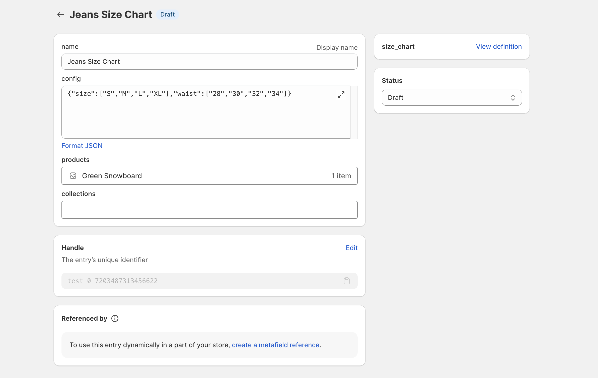

# 🚀 Shopify MetaObject ORM

This is a simple ORM for Shopify's MetaObject API. Which simplifies the process of creating, updating, and deleting metaobjects and its definitions.
**_Note: This is still in development/alpha and not ready recommended for production use._**

### 🌟 Features
- Migration Support: Migrate metaobject definitions to Shopify with ease.
- Simplified MetaObject Management: Easily create, update, and delete Shopify metaobjects.
- Efficient Schema Definitions: Define metaobject schemas with ease.
- GraphQL Client Integration: Seamlessly works with Shopify's GraphQL client.
- CRUD Operations Made Easy: Intuitive methods for all your CRUD needs.
- Pagination Support: Supports pagination for listing metaobjects.

### Screenshots




### 📖 Our Story
Initially developed for internal use in our [apps](https://apps.shopify.com/partners/appzola), Shopify MetaObject ORM proved to be a game-changer in how we interacted with Shopify's MetaObject API. It not only enhanced our productivity but also brought an unmatched level of simplicity to complex tasks.

The turning point came when [@blanklob](https://twitter.com/blanklob) [tweeted](https://twitter.com/blanklob/status/1729901729175515273) about the need for a simplified approach to managing Shopify's metaobjects. This tweet resonated with our experience, and we were inspired to contribute our solution to the community.

A big shoutout to [@blanklob](https://twitter.com/blanklob)  for the inspiration and to the vibrant Shopify developer community for their continuous support and feedback!


<!-- ### 📦 Installation

```bash
npm i shopify-orm
``` -->

### 🚀 Quick Start Guide

Tune to [examples](./examples) for more examples. 
I used `bun` to run the examples. No typescript compilation is required.


Create a graphql client using `@shopify/graphql-client`

```js
import { createGraphQLClient } from "@shopify/graphql-client";
const client = createGraphQLClient({
  url: "https://myshop.myshopify.com/admin/api/2023-10/graphql.json",
  headers: {
    "Content-Type": "application/json",
    "X-Shopify-Access-Token": "<token>",
  },
  retries: 1,
});
```

Define your metaobject schema, In below example we are defining a `size_chart` metaobject with `name`, `config`, `products`, and `collections` fields.

```ts
const sizeChart: OrmSchema = metaobject(
  "size_chart",
  {
    name: {
      name: "name",
      type: "single_line_text_field",
    },
    config: {
      name: "config",
      type: "json",
    },
    products: {
      name: "products",
      type: "list.product_reference",
    },
    collections: {
      name: "collections",
      type: "list.collection_reference",
    },
  },
  {
    displayNameKey: "name",
    capabilities: {
      publishable: {
        enabled: true,
      },
    },
    admin_access: "PUBLIC_READ_WRITE",
    access: {
      admin: "PUBLIC_READ_WRITE",
      storefront: "PUBLIC_READ",
    },
  }
);
```

Create a db instance using the client

```ts
const db = shopifyORM(client);
```

Create CRUD instances for your metaobjects

```ts
const sizeChartSchema = db.metaobject(sizeChart);
```

## Operations

### Migrate

When you call migrate function, It will check the metaobject definition in shopify and update it if it is not matching with the local definition. If the metaobject is not present in shopify, It will create it.

```ts
const resp = await sizeChartSchema.migrate();
```

### Create
Create a new metaobject by passing data
```js
const createdItems = await sizeChartSchema.create({
  data: {
    name: "Jeans Size Chart",
    config: {
      size: ["S", "M", "L", "XL"],
      waist: ["28", "30", "32", "34"],
    },
    products: ["gid://shopify/Product/8537198461244"],
  },
});
```

### List

List items in `items` and `pageInfo` for additional information like `hasNextPage`, `hasPreviousPage`, `startCursor`, `endCursor`, `pageSize`.

```js
const items = await sizeChartSchema.list({
  first: 10,
});
```

### Update
Update metaobject by id and data
```js
const item = await sizeChartSchema.update({
  id: "gid://shopify/Metaobject/24441422140",
  data: {
    name: "Jeans Size Chart",
    config: {
      size: ["S", "M", "L", "XL"],
      waist: ["28", "30", "32", "34"],
    },
    products: ["gid://shopify/Product/8537198461244"],
  },
});
```

### Get
Get single item by id
```js
const item = await sizeChartSchema.get({
  id: "gid://shopify/Metaobject/24354980156",
});
```

### Delete
Delete single item by id
```js

const deletedItem = await sizeChartSchema.delete({
  id: "gid://shopify/Metaobject/24354980156",
});
```

### 👥 Contributing
We welcome contributions! Please see our contributing guidelines for more details.

### 📬 Feedback
Your feedback is valuable to us. Please reach out with suggestions or issues.
